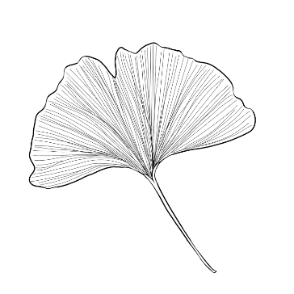
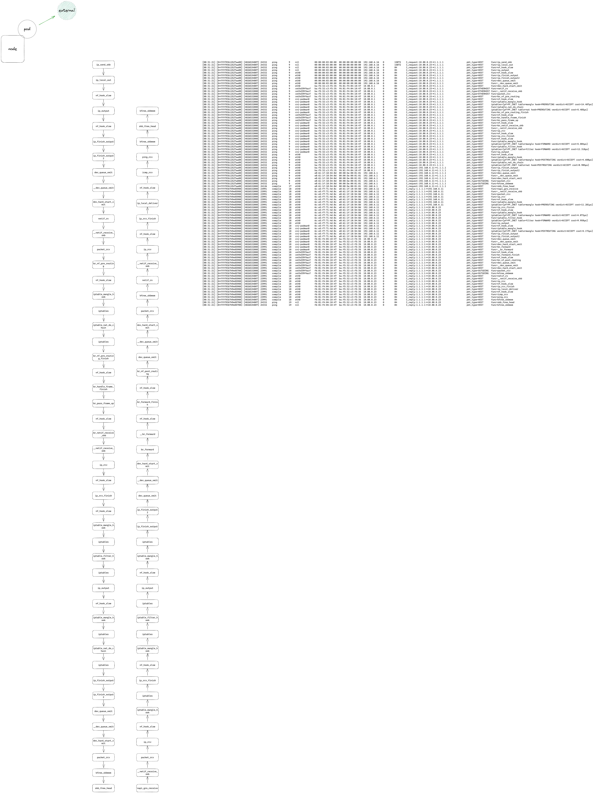
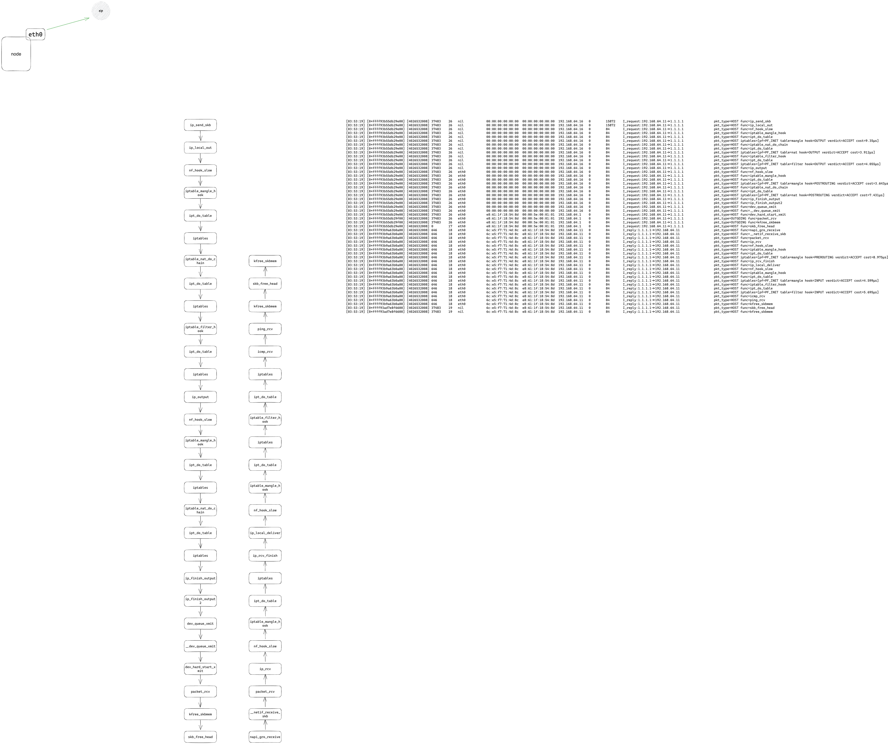
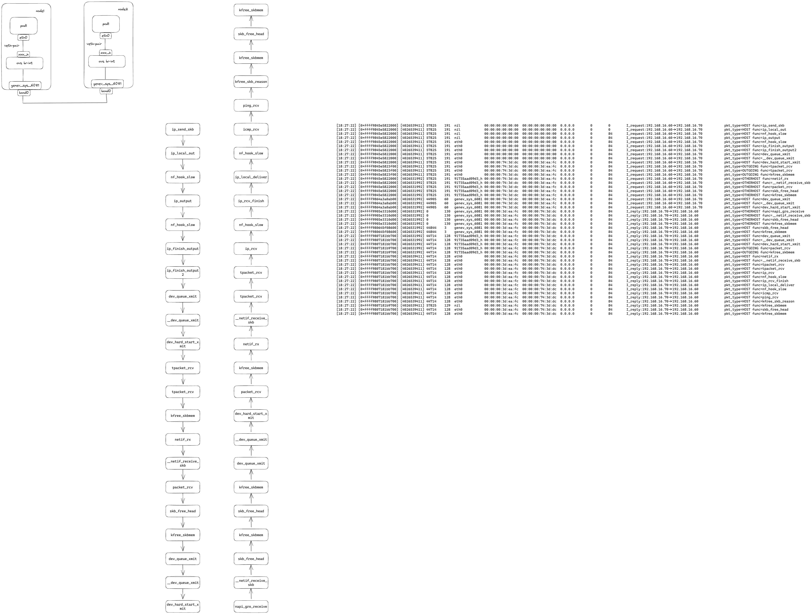

# leaf

network design and self-check through leaf


## Build and run
1、docker pod 访问 外网
```bash
# git clone https://github.com/linuxkerneltravel/leaf.git
# cd leaf
# make build
# ./leaf -H 1.1.1.1
# pod eth0 10.88.0.23, ping 1.1.1.1 -c 1
```


2、node 访问 eip
```bash
# ./leaf -H 1.1.1.1 --proto icmp  --scene node2eip -d
# node eth0 192.168.64.11, ping 1.1.1.1 -c 1
```

3、pod 访问 不通node的 pod 


4、
## Contributing

This is an open source project. The userspace code is licensed under
[Apache-2.0](LICENSE), while the BPF under [BSD 2-Clause](bpf/LICENSE.BSD-2-Clause)
and [GPL-2.0](bpf/LICENSE.GPL-2.0). Everybody is welcome to contribute.
Contributors are required to follow the [Contributor Covenant Code of
Conduct](https://www.contributor-covenant.org/version/1/4/code-of-conduct/) and
must adhere to the [Developer Certificate of
Origin](https://developercertificate.org/) by adding a Signed-off-by line to
their commit messages.
